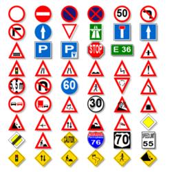

# Traffic_Sign_Identification
Identifying traffic signs can be used in different use cases like in self driving cars. In this project, it is implemented using Convolutional Neural Networks (CNNs), which is used widely in different applications of Artificial Intelligence.

The aim of this project is to classify correctly the different classes of Traffic signs available.

## MetaData
The dataset is taken from kaggle, "German Traffic Sign Recognition", which has a multi-class data. The dataset includes:
- More than 40 classes
- More than 50,000 images in total
- Large, lifelike database

The dataset is divided into 2 parts:
- **Train**: It includes images divided into 0 to 42 subfolders for training purpose where each subfolder contain images related to that particular class only and such division of images is applied same to the other different subfolder also.
- **Test**: It includes approx 12,500 images of random traffic signs and their labels are mentioned in an excel file for evaluation of model.

## Implementation Overview
This project is implemented using different libraries and modules, importantly, **Tensorflow and Keras**. Initially, the images is preprocessed and their size is reduced to 30 by 30 pixel for better and fast preprocessing and converted into n-dimensional arrays. After preprocessing the images, the training dataset is divided into 80-20% for evaluating the training and validation accuracy. Once the dataset is splitted, we started creating the architecture of CNN by adding some convolutional and pooling layers along with dropout layers for the purpose of overcoming overfitting.

  Once the architecture of CNN is ready, **the optimizer, 'adam'**, is initialized and then model start to train itself on different images of different classes. The Epoch value decided is 15 after which training accuracy (96.36%) doesn't seems to change that much. After model is trained, then we feed our unseen test images to the model to predict the results which we had checked with the correct labels that we already have of those corresponding images. **The test accuracy is found to be 96.20%** which is pretty much similar to that of the training dataset accuracy.

  After building and evaluating the model, model's weight has been saved in a file, **model.h5**.

## Tools/Libraries Used:
- Python
- OS module
- Numpy
- Pandas
- Tensorflow
- Keras
- PILLOW
- Sci-kit Learn

## Conclusion:
The model is succesfully implemented and deployed in a file for reusability and it's been a really exciting project.
